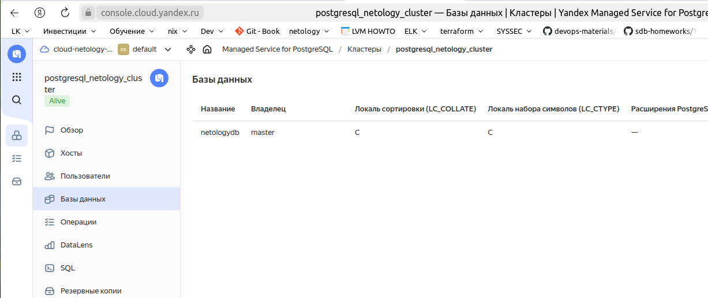

# Домашнее задание к занятию "`Базы данных в облаке`" - `Аблогин Павел`

---

1. `Создал кластер PostgreSQL с именем postgresql_netology_cluster и БД с именем netologydb;`
2. `Подключился к мастеру и реплике;`
3. `Проверил работоспособность репликации в кластере`

`Скриншоты выполнения задания`

